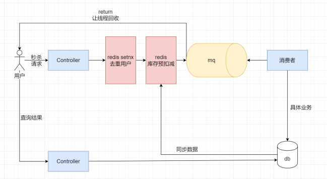

# RocketMQ+Redis 实现秒杀

RocketMQ 学习笔记: www.zgtsky.top

对数据库进行操作时，有三种方式完成多线程任务。

1 ：直接对整个service.xxx方法加synchronized锁

2 ：对mysql语句中 使用stocks = stocks - 1更新数据，数据库会自行加上行锁

>   update goods set stocks = stocks - 1 ,update_time = now() where id = #{value}

3 ： 使用redis 完成分布式锁